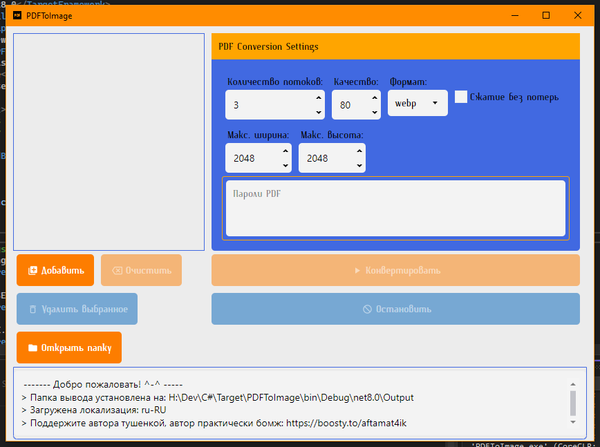
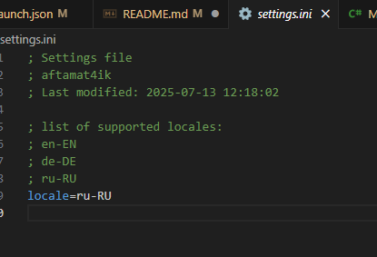
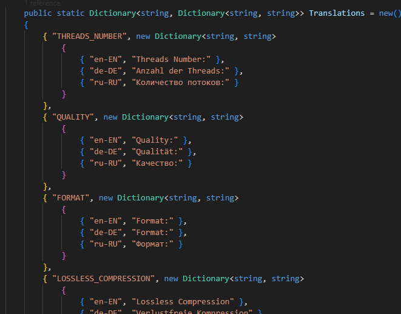

# PDFToImage

This is simple multithreaded extractor of images from PDF files.

It looks like this:

Out of box it supports 3 lanuages: Russian, English, Deutch.
To change default language use `settings.ini` file.

If you want to localise this application for your language e.g. Vietnam, Chinese, Indian, you can do so by editing file "Localisation/Localisation.cs". Tehre is very basic dictionary with localisation lines.

